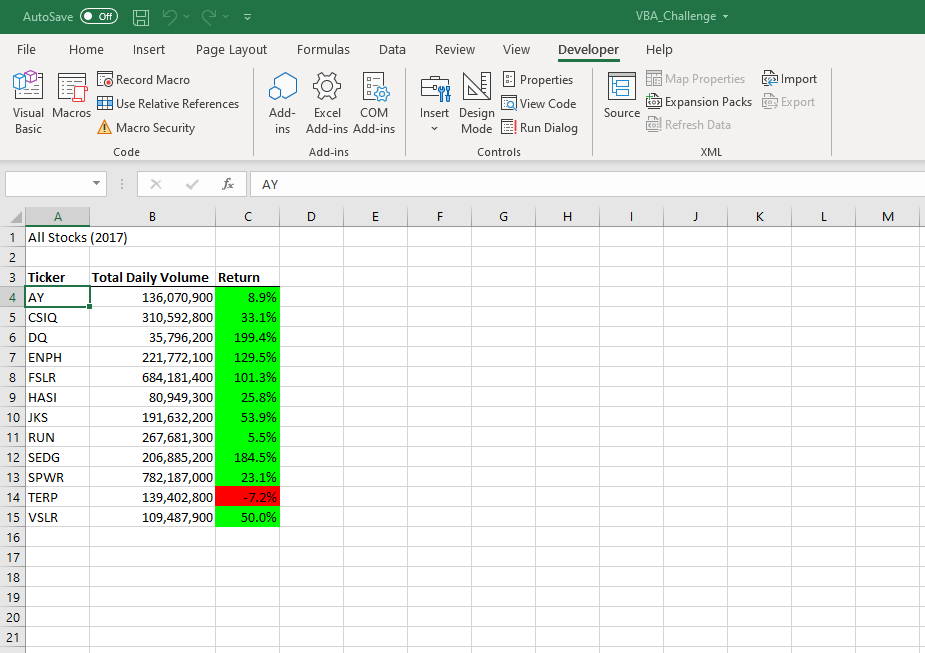
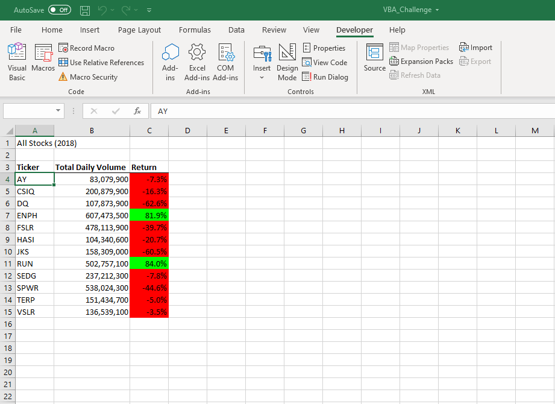

# Stock Market Analysis with VBA

## Overview of Project

This refactored code is a VBA macro which is used to efficiently evaluate a significant amount of tabular stock data. 

## Results
###### 2017 Stocks

As shown by the image of the output above, most of these stocks saw a positive return in 2017, with the exception of TERP.
###### 2018 Stocks

These same stocks in 2018 saw a sharp decrease in percent return, almost of all of them hitting negative values. The only stock which performed better in 2018 than 2017 from this group was RUN.

###### Refactored Code Run Time Results

The All Stocks Analysis Macro had respective run times of 5 and 4 seconds for the 2017 and 2018 datasets. These run times are effectively just as fast as the original DQ analysis code. Although the original macro was not timed, one could easily tell that there was no significant difference between the two. ALso note that the refactored code analyzed all stock tickers, while the original code only dealt with the DQ ticker.

## Summary

###### Benefits of Refactoring
Refactoring code, relative to writing original code, is significantly quicker and easier for beginning coders as it provides a base for one to work off of. A macro with a starting place,a backbone, and an established purpose makes writing code more user friendly, with helpful guidelines. 

###### Issues with Refactoring
A potential issue with refactoring code is that the coder may end up blindly using lines which they do not fully understand. Refactoring, to some extent, relies on borrowing code instead of writing new code. Therefore it may cause some to maintain holes in their codings skills and understanding. 
